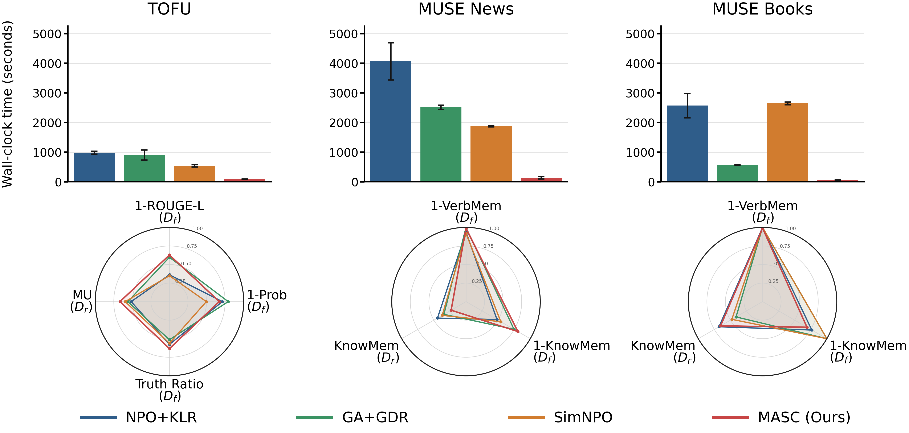

# MASC Reproducibility Bundle



This repository contains the code needed to reproduce the MASC runs for TOFU and MUSE News, plus the core training/evaluation entrypoints for the scaling experiments. It intentionally excludes plotting scripts, checkpoints, model weights, local caches, API keys, and machine-specific paths. A static rendered summary figure is included for README display.

## Contents

- `scripts/run_margin_unlearning.py`: main MASC trainer for TOFU and MUSE raw-text runs.
- `scripts/run_margin_unlearning_qwen.py`: Qwen scaling variant of the MASC trainer.
- `repro/`: portable download, train, and eval wrappers that resolve paths from this repo root.
- `assets/metric_runtime_sixpanel.png`: static README figure rendered from the original PGF/plot artifact.
- `open-unlearning/`: trimmed third-party OpenUnlearning subset used for TOFU configs/evaluation and Qwen TOFU finetuning.
- `muse_bench/`: trimmed third-party MUSE News evaluation code.
- `exp_scaling/`: Qwen scaling manifests and core training/evaluation launchers. Plotting scripts and generated figures are not included.

See `THIRD_PARTY.md` for provenance of bundled external code.

## Setup

```bash
python -m venv .venv
source .venv/bin/activate
pip install -r requirements.txt
```

For Llama-2 assets, authenticate with Hugging Face in your environment. Do not commit tokens.

```bash
huggingface-cli login
```

## Download Assets

```bash
python repro/download_assets.py --target all
```

Useful subsets:

```bash
python repro/download_assets.py --target tofu
python repro/download_assets.py --target news
python repro/download_assets.py --target scaling
```

## MASC Hyperparameters

| Dataset | lambda_fg | rho | eta | top-k | beta | stop alpha | LR | LoRA rank |
| --- | ---: | ---: | ---: | ---: | ---: | ---: | ---: | ---: |
| TOFU | 0.05 | 0.70 | 0.25 | 10 | 1.0 | 0.475 | 1e-4 | 16 |
| MUSE News | 0.50 | 0.70 | 0.50 | delta/top-2 | 5.0 | 0.55 | 1e-4 | 16 |

## Run TOFU

```bash
bash repro/run_masc_tofu.sh
bash repro/eval_tofu.sh
```

The default output is `outputs/tofu_masc_seed42`. Set `SEED`, `OUT_DIR`, `MODEL_DIR`, or `PYTHON` as environment variables to override.

## Run MUSE News

```bash
bash repro/run_masc_news.sh
bash repro/eval_muse_news.sh
```

The MUSE News eval wrapper defaults to `verbmem_f`, `knowmem_f`, and `knowmem_r`. To include the official privacy-leakage metric as well:

```bash
INCLUDE_PRIVLEAK=1 bash repro/eval_muse_news.sh
```

## Scaling Experiments

The Qwen2.5 scaling manifest is in `exp_scaling/manifests/qwen25_tofu_scaling.json`.

```bash
python exp_scaling/scripts/download_family_models.py \
  --manifest exp_scaling/manifests/qwen25_tofu_scaling.json
```

Key scaling entrypoints:

- `exp_scaling/scripts/run_tofu_full_finetune.py`
- `exp_scaling/scripts/run_tofu_retain_finetune.py`
- `exp_scaling/scripts/run_unlearn_qwen25_family_tofu_selftopk_besthp_from_full.sh`
- `exp_scaling/scripts/run_eval_qwen25_family_tofu_selftopk_besthp_qwen_template_vs_retain90.sh`

Run shell scripts from the repo root. They have been scrubbed to use repo-relative paths.
